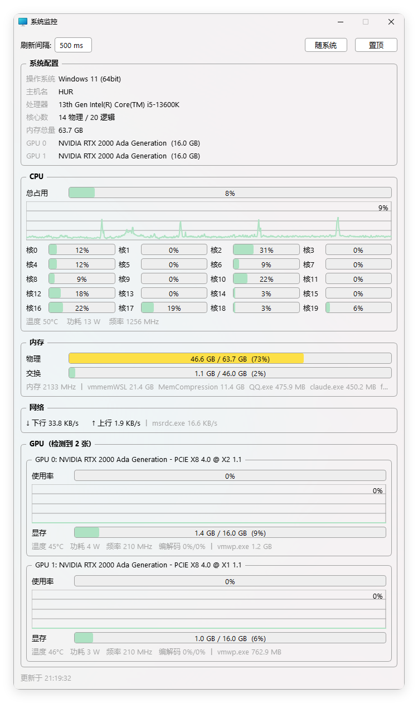
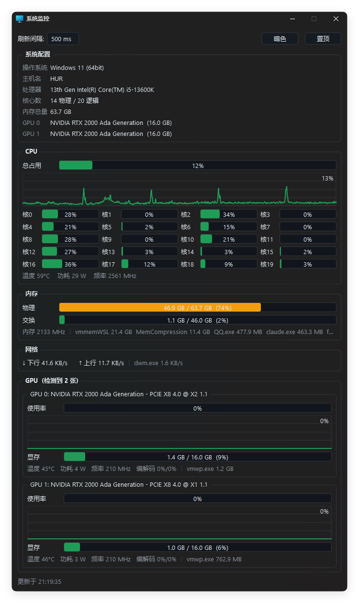
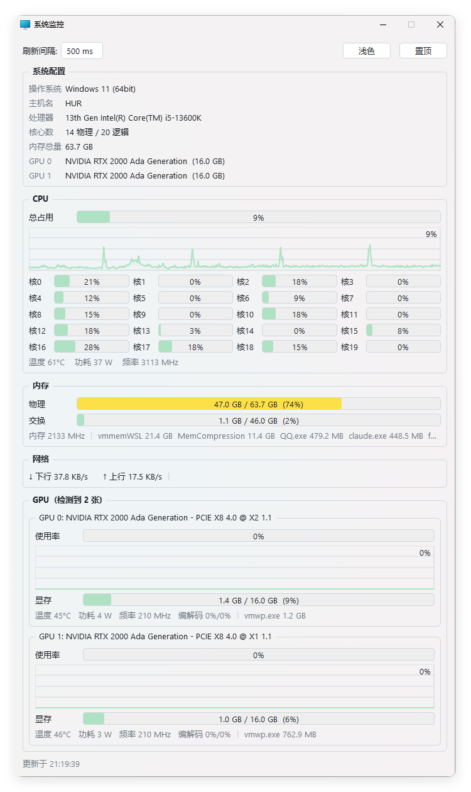

# SysMonitor — PyQt6 系统监控工具

Windows 桌面系统监控面板：CPU / 内存 / 网络 / 多 GPU 实时监控，
支持每进程显存与网络流量、三态主题与 Windows 11 Mica 云母材质。

| 随系统 | 暗色 | 浅色 |
|:---:|:---:|:---:|
|  |  |  |

## 功能

**系统配置**
- 操作系统 / 主机名 / CPU 型号（注册表 `ProcessorNameString`，与任务管理器一致）
- 物理/逻辑核心数、内存总量、全部 GPU 型号与显存

**CPU**
- 总占用 + 每逻辑核心占用（进度条网格）+ 历史曲线
- 温度：Windows 内置性能计数器，来源标记 `(Perf)` 或 `(ACPI)`
- 功耗：Windows 内置 EMI 能量计量计数器（`\Energy Meter(*_PKG)\Power`），无需驱动
- 实时频率：`% Processor Performance` × 标称频率，随睿频/降频实时变化

**内存**
- 物理 / 交换分区占用，内存条频率（WMI）
- 内存占用最高的进程排行（后台线程枚举，不阻塞 UI）

**网络**
- 总上下行速率
- 每进程网络流量排行（PDH IO 计数器）

**GPU（多卡自适应）**
- 每卡独立卡片：使用率 + 历史曲线、显存占用
- 温度 / 功耗 / 核心频率 / 编解码（NVENC/NVDEC）利用率
- 标题实时显示 PCIe 链路（GPU-Z 格式：`PCIe x8 4.0 @ x1 1.1`，最大能力 @ 当前协商）
- 每进程显存占用：Windows `GPU Process Memory` 性能计数器（任务管理器同源），
  按 CUDA luid↔PCI busId 精确归卡；WSL2 的占用显示为宿主进程 `vmwp.exe`

**界面**
- 三态主题：随系统（实时跟随系统深浅色与强调色变化）/ 暗色 / 浅色
- Windows 11 Mica 云母材质（`DWMWA_SYSTEMBACKDROP_TYPE`，DWM 原生）
- 窗口置顶开关；高度按核心数/GPU 数动态计算（≤4 卡不出现滚动条）
- 系统托盘：关闭最小化到托盘，双击恢复，右键退出
- 分区刷新：CPU/GPU 状态可调（100–1000ms），内存与显存固定 100ms，网络固定 1000ms

## 运行

环境由 [uv](https://docs.astral.sh/uv/) 管理（`pyproject.toml` + `uv.lock`）：

```powershell
uv sync
uv run python monitor.py
```

无需管理员权限。

## 构建 exe

使用 [Nuitka](https://nuitka.net/) 编译为原生单文件 exe。本地一键构建（产物 `SysMonitor.exe`）：

```powershell
.\build.ps1
```

自动构建（推 tag 即发版，产物附加到 Release）：

```powershell
git tag v1.x.x
git push origin master v1.x.x
```

- **Forgejo Actions**（[.forgejo/workflows/build.yml](.forgejo/workflows/build.yml)）：
  自托管 Windows runner（标签 `windows`，host 模式），产物经内网 API 直传 Release
- **GitHub Actions**（[.github/workflows/build.yml](.github/workflows/build.yml)）：
  GitHub 托管 `windows-latest` runner（uv + MSVC），产物上传 artifact 并附加到 GitHub Release

## 数据来源与已知限制

| 数据 | 来源 | 条件 / 限制 |
|------|------|------------|
| CPU 温度 | `Win32_PerfFormattedData_Counters_ThermalZoneInformation` / `MSAcpi_ThermalZoneTemperature` | 免管理员 |
| CPU 功耗 | EMI 能量计数器 | 免管理员 |
| CPU 实时频率 | PDH `% Processor Performance` | 免管理员 |
| 每进程显存 | PDH `GPU Process Memory` 计数器 | 免管理员 |
| 每进程网络 | PDH IO 计数器 | 免管理员 |
| GPU 全部指标 | NVML（nvidia-ml-py） | 仅 NVIDIA |

## 许可证

本项目采用 [MIT License](LICENSE)。
